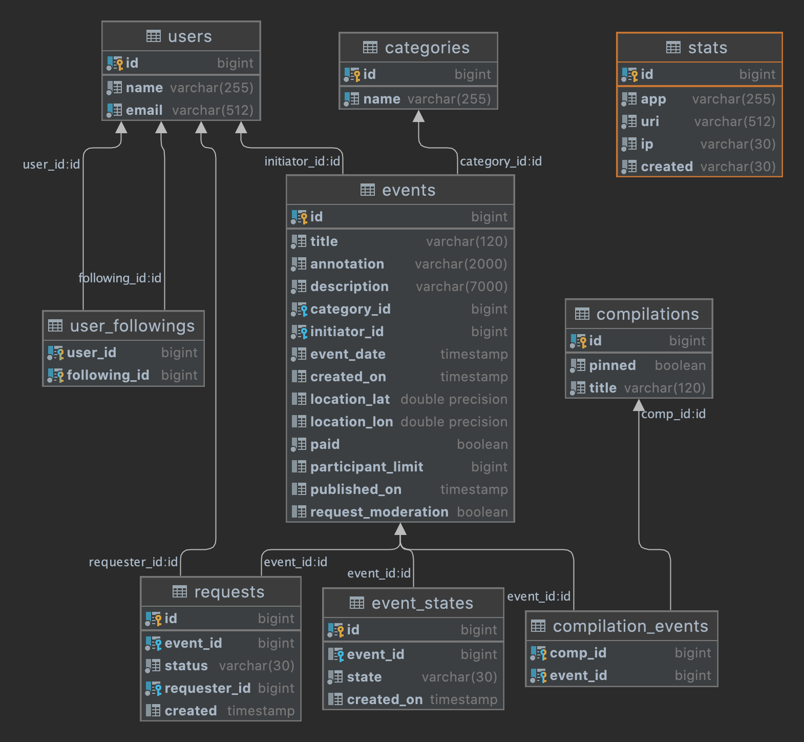

# Explore With Me - Исследуй со мной
Приложение ExploreWithMe (англ. «исследуй со мной».) дает возможность делиться информацией об интересных событиях и помогать найти компанию для участия в них.

#### Ссылка на репозиторий - https://github.com/tochmary/explore-with-me/
#### Ссылка на редактор Swagger - https://editor-next.swagger.io/
    Импортируйте в редактор файлы спецификации (File → Import File). 
    a. спецификация основного сервиса (swagger/ewm-main-service-spec.json)
    b. спецификация сервиса статистики (swagger/ewm-stats-service-spec.json)

#### Приложение состоит из двух сервисов:
1) main-cervice
Основной сервис — содержит всё необходимое для работы продукта.
2) stats-service
Сервис статистики — хранит количество просмотров и позволяет делать различные выборки для анализа работы приложения.

#### Запуск приложения
1) Запуск через Docker
Открыть Docker Desktop
В Idea команда (mvn clean, mvn package)
В терминале перейти в папку с приложением "cd /explore-with-me", потом "docker-compose up --build"
Для остановки приложения "docker-compose down"
2) Запуск сервисов в Idea
На вкладке Services добавить Run Configuration Type - Spring Boot
Для каждого сервиса прописать Environment variables -
SPRING_DATASOURCE_URL=jdbc:postgresql://localhost:5432/ewm;POSTGRES_USER=user;POSTGRES_PASSWORD=user;EWM_STATS_SERVICE_URL=http://localhost:9090

#### Схема базы данных

#### Таблицы сервиса main-service
1. [ categories ](#categories)
2. [ users ](#users)
3. [ events ](#events)
4. [ event_states ](#event_states)
5. [ requests ](#requests)
6. [ compilations ](#compilations)
7. [ compilation_events ](#compilation_events)

#### Таблицы сервиса stats-service
1. [ stats ](#stats)

##### categories
    Таблица категорий:
    id — Идентификатор категории;  
    name — Название категории;

##### users
    Таблица пользователей:
    id — уникальный идентификатор пользователя;
    name — имя или логин пользователя;
    email — адрес электронной почты (учтите, что два пользователя не могут иметь одинаковый адрес электронной почты).

##### events
    Таблица событий:
    id - Идентификатор;
    annotation - Краткое описание;
    category - Категория;
    created_on - Дата и время создания события (в формате \"yyyy-MM-dd HH:mm:ss\";
    description - Полное описание события;
    event_date - Дата и время на которые намечено событие (в формате \"yyyy-MM-dd HH:mm:ss\");
    initiator - Пользователь (краткая информация);
    location - Широта и долгота места проведения события;
    paid - Нужно ли оплачивать участие;
    participant_limit - Ограничение на количество участников. Значение 0 - означает отсутствие ограничения;
    published_on - Дата и время публикации события (в формате \"yyyy-MM-dd HH:mm:ss\");
    request_moderation - Нужна ли пре-модерация заявок на участие;
    title - Заголовок;

##### event_states
    Таблица состояний события:
    id - Идентификатор записи
    event_id - Идентификатор события
    state - Состояние (PENDING, PUBLISHED, CANCELED)
    created_on - Дата и время создания

##### requests
    Таблица запросов на участие:
    Заявка на участие в событии:
    id - Идентификатор заявки
    event_id - Идентификатор события
    status - Статус заявки
    requester_id - Идентификатор пользователя, отправившего заявку
    created - Дата и время создания заявки

##### compilations
    Таблица подборок:
    Подборка событий:
    id - Идентификатор
    pinned - Закреплена ли подборка на главной странице сайта
    title - Заголовок подборки

##### compilation_events
    Таблица связей подборки с событиями:
    comp_id - Идентификатор подборки
    event_id - Идентификатор события

##### stats
    Таблица статистики:
    id — Идентификатор записи;
    app — Идентификатор сервиса для которого записывается информация;
    uri - URI для которого был осуществлен запрос;
    ip - IP-адрес пользователя, осуществившего запрос;
    created - Дата и время, когда был совершен запрос к эндпоинту (в формате \"yyyy-MM-dd HH:mm:ss\").
